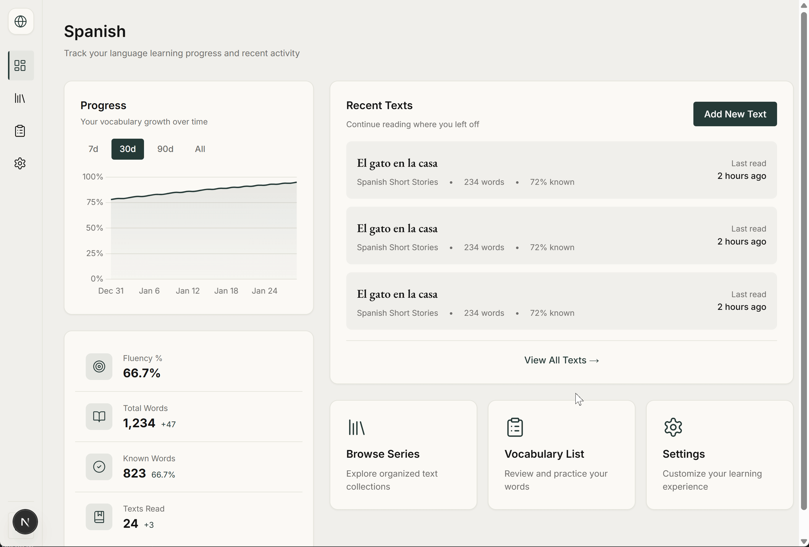

## Verbista

A language learning reader that tracks vocabulary at the lemma level, so your known-word count reflects what you actually know rather than how many surface forms you've encountered.

**Live Demo:** [verbista.vercel.app](https://verbista.vercel.app)

## Demo



## Why I Built It

I was learning Russian and couldn't find a reader that tracked vocabulary at the lemma level. Existing tools counted word forms separately, which inflated known-word counts: "идти," "иду," and "шёл" would register as three distinct words instead of one. So I built a reader that treats them all as the same lemma and tracks progress accordingly.

## How It Works

- Paste any foreign-language text into the importer. A spaCy microservice (FastAPI on Railway) tokenizes and lemmatizes the text on import.
- The pipeline tags parts of speech and lemmatizes each word form down to its root.
- Word instances are pre-computed at import time and stored, so the reader loads instantly on subsequent visits without reprocessing.
- Each lemma in your vocabulary gets a status based on your reading history: Newly Seen, Familiar, Known, Well-Known, or Ignored.
- The reader highlights words inline by status tier, giving you a live picture of what you know and what you are still learning.
- Known-word percentage is tracked per text and per series over time, so you can see your vocabulary grow as you read.

## Tech Stack

| Layer | Technology |
|---|---|
| Framework | Next.js 16 (App Router) |
| Language | TypeScript (strict) |
| Database | Supabase (PostgreSQL) via Drizzle ORM |
| NLP | spaCy + FastAPI (Railway microservice) |
| Data Fetching | TanStack Query v5 |
| Charts | Chart.js |
| Styling | Tailwind CSS v4 |

## Features

- Lemma-first vocabulary tracking: inflected forms resolve to their root, so "шёл," "иду," and "идти" all count toward the same word
- Five-tier status system (Newly Seen, Familiar, Known, Well-Known, Ignored) with inline color-coded highlighting that does not interrupt reading flow
- spaCy NLP pipeline handles tokenization, POS tagging, and lemmatization — results stored at import time for instant reader loads
- Series support: group related texts and track cumulative vocabulary progress across a collection
- Known-word percentage displayed per text and per series, updated as you interact with words
- Reader settings (font size, highlight intensity) persisted locally across sessions

## Getting Started

### Prerequisites

- Node.js 18+
- A Supabase project for the database
- A running spaCy FastAPI microservice

### Installation

```bash
npm install
```

Create a `.env.local` file:

```
DATABASE_URL=your_supabase_connection_string
NLP_SERVICE_URL=https://your-nlp-service.railway.app
ADMIN_API_KEY=your_admin_api_key
NEXT_PUBLIC_ADMIN_API_KEY=your_admin_api_key
```

Push the schema to your database:

```bash
npm run db:push
```

Start the dev server:

```bash
npm run dev
```

Open [http://localhost:3000](http://localhost:3000).

### Commands

```bash
npm run dev          # localhost:3000
npm run build        # production build
npm run lint         # ESLint
npm run db:push      # push schema to Supabase
npm run db:studio    # Drizzle Studio UI
```
